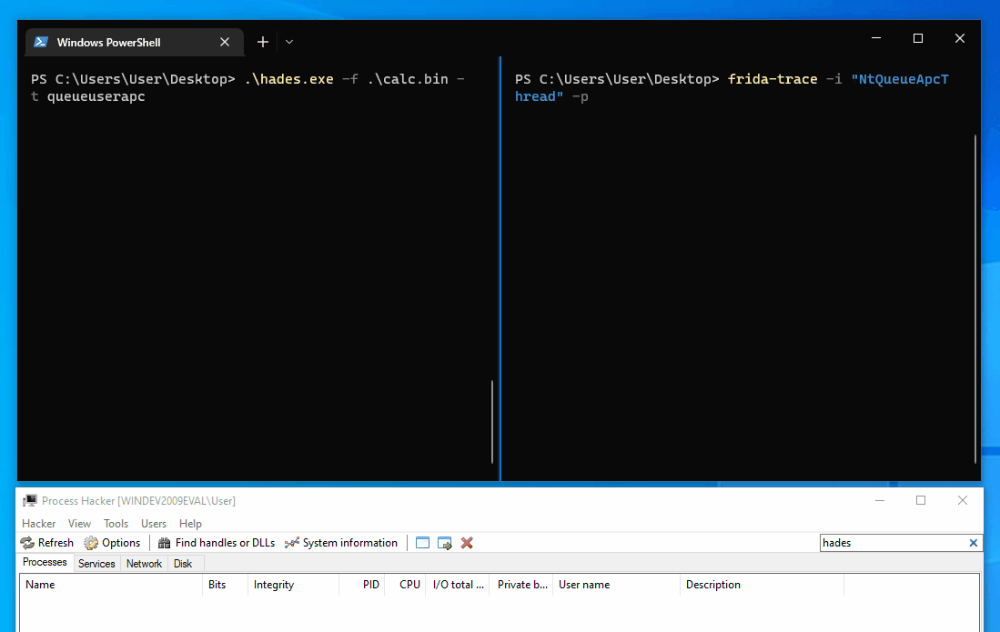

<p align="center">
    
</p>
<p align="center">
  <a href="https://github.com/f1zm0/hades/releases">
    
</a>
<a href="https://github.com/f1zm0/hades">
    
</a>
<a href="https://github.com/f1zm0/hades/issues">
    
  </a>
<a href="#">  </a>
</p>

<p align="center">
  <i>SSN sorting and direct syscall invocation for AV/EDR evasion in Go and Go ASM</i>
</p>

## Disclaimer

The techniques used in this project are not new. This project is just a proof of concept, and has been created for educational purposes only, to experiment with malware dev in Go, and learn more about the [unsafe](https://pkg.go.dev/unsafe) package and the weird [Go Assembly](https://go.dev/doc/asm) syntax.

## Usage

The easiest way, is probably building the project on Linux using `make`.

```sh
git clone https://github.com/f1zm0/hades && make
```

Then you can bring the executable to a x64 Windows host and run it with `./hades` or `./hades -h` to see the available options.

```
PS > .\hades.exe -h

  '||'  '||'     |     '||''|.   '||''''|   .|'''.|
   ||    ||     |||     ||   ||   ||  .     ||..  '
   ||''''||    |  ||    ||    ||  ||''|      ''|||.
   ||    ||   .''''|.   ||    ||  ||       .     '||
  .||.  .||. .|.  .||. .||...|'  .||.....| |'....|'

          version: dev [11/01/23] :: @f1zm0

Usage:
  hades -f <filepath> [-t selfthread|remotethread|queueuserapc]

Options:
  -f, --file <str>        shellcode file path (.bin)
  -t, --technique <str>   injection technique [selfthread, remotethread, queueuserapc]
```

For instance you can run the tool with:

```
.\hades.exe -f calc.bin -t queueuserapc
```

## Showcase

Below is a very quick proof of concept of the tools, that is used to inject a simple calc shellcode with APC injection, while intercepting the call to `NtQueueApcThread` with [Frida](https://frida.re). The tool doesn't care about the hook and instead uses the RVAs of `Zw*` functions to calculate the SSN of `NtQueueApcThread` and make a direct system call.



## Credits

Big thanks to the following people that shared their knowledge and code that inspired this tool:

- [@smelly\_\_vx](https://twitter.com/smelly_vx) and [@am0nsec](https://twitter.com/am0nsec) creators of [Hell's Gate](https://github.com/am0nsec/HellsGate)
- [@modexp](https://twitter.com/modexpblog)'s excellent blog post [Bypassing User-Mode Hooks and syscall invocation in C](https://www.mdsec.co.uk/2020/12/bypassing-user-mode-hooks-and-direct-invocation-of-system-calls-for-red-teams/)
- [@ElephantSe4l](https://twitter.com/elephantse4l) creator of [FreshyCalls](https://github.com/crummie5/FreshyCalls)
- [@C_Sto](https://twitter.com/c__sto) creator of [BananaPhone](https://github.com/C-Sto/BananaPhone)

## License

This project is licensed under the GPLv3 License - see the [LICENSE](LICENSE) file for details
