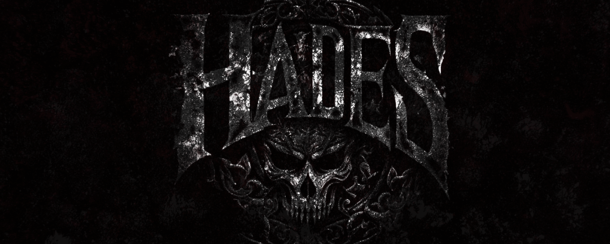
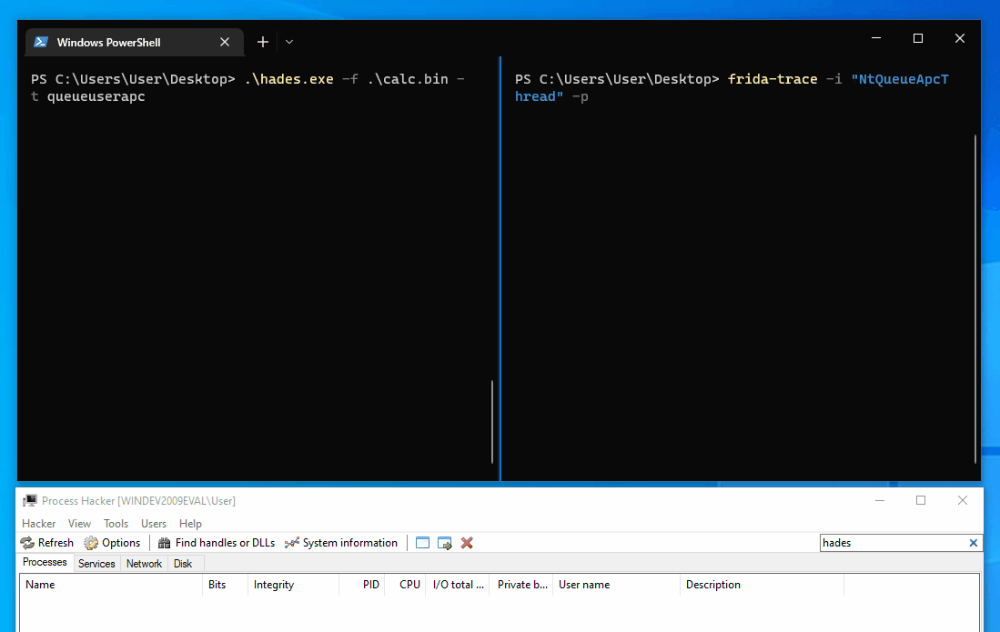
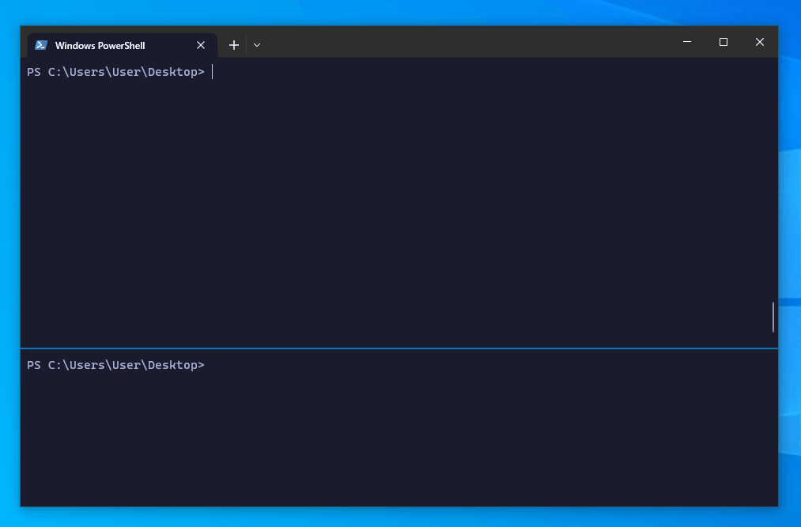

<p align="center">
    
</p>
<p align="center">
  <a href="https://github.com/f1zm0/hades/releases">
    
</a>
<a href="https://pkg.go.dev/github.com/f1zm0/hades"></a>
    <!-- <a href="https://github.com/f1zm0/hades/releases"></a> -->
<a href="https://github.com/f1zm0/hades">
    
</a>
  </a>
<a href="#">  </a>
    <a href="https://twitter.com/f1zm0" target="_blank"></a>
</p>

## About

**Hades** is a proof of concept loader that combines several evasion technques with the aim of bypassing the defensive mechanisms commonly used by modern AV/EDRs.

## Usage

The easiest way, is probably building the project on Linux using `make`.

```sh
git clone https://github.com/f1zm0/hades && cd hades
make
```

Then you can bring the executable to a x64 Windows host and run it with `.\hades.exe [options]`.

```
PS > .\hades.exe -h

  '||'  '||'     |     '||''|.   '||''''|   .|'''.|
   ||    ||     |||     ||   ||   ||  .     ||..  '
   ||''''||    |  ||    ||    ||  ||''|      ''|||.
   ||    ||   .''''|.   ||    ||  ||       .     '||
  .||.  .||. .|.  .||. .||...|'  .||.....| |'....|'

          version: dev [11/01/23] :: @f1zm0

Usage:
  hades -f <filepath> [-t selfthread|remotethread|queueuserapc]

Options:
  -f, --file <str>        shellcode file path (.bin)
  -t, --technique <str>   injection technique [selfthread, remotethread, queueuserapc]
```

### Example:

Inject shellcode that spawms `calc.exe` with [queueuserapc](https://docs.microsoft.com/en-us/windows/win32/api/processthreadsapi/nf-processthreadsapi-queueuserapc) technique:

```
.\hades.exe -f calc.bin -t queueuserapc
```

## Showcase

User-mode hooking bypass with syscall RVA sorting  (`NtQueueApcThread` hooked with [frida-trace](https://frida.re) and [custom handler](scripts/NtQueueApcThread.js))



Instrumentation callback bypass with indirect syscalls (injected DLL is from [syscall-detect](https://github.com/jackullrich/syscall-detect) by [jackullrich](https://twitter.com/winternl_t))



## Additional Notes

### Direct syscall version

In the latest release, direct syscall capabilities have been replaced by indirect syscalls provided by [acheron](https://github.com/f1zm0/acheron). If for some reason you want to use the previous version of the loader that used direct syscalls, you need to explicitly pass the `direct-syscall` tag to the compiler, which will figure out what files needs to be included and excluded from the build.

```sh
GOOS=windows GOARCH=amd64 go build -ldflags "-s -w" -tags='direct_syscalls' -o dist/hades_directsys.exe cmd/hades/main.go
```

### Disclaimers

> **Warning**  </br>
> This project has been created for educational purposes only, to experiment with malware dev in Go, and learn more about the [unsafe](https://pkg.go.dev/unsafe) package and the weird [Go Assembly](https://go.dev/doc/asm) syntax.
> Don't use it to on systems you don't own. The developer of this project is not responsible for any damage caused by the improper use of this tool.

## Credits

Shoutout to the following people that shared their knowledge and code that inspired this tool:

- [@smelly\_\_vx](https://twitter.com/smelly_vx) and [@am0nsec](https://twitter.com/am0nsec) creators of [Hell's Gate](https://github.com/am0nsec/HellsGate)
- [@modexp](https://twitter.com/modexpblog)'s excellent blog post [Bypassing User-Mode Hooks and syscall invocation in C](https://www.mdsec.co.uk/2020/12/bypassing-user-mode-hooks-and-direct-invocation-of-system-calls-for-red-teams/)
- [@ElephantSe4l](https://twitter.com/elephantse4l) creator of [FreshyCalls](https://github.com/crummie5/FreshyCalls)
- [@C_Sto](https://twitter.com/c__sto) creator of [BananaPhone](https://github.com/C-Sto/BananaPhone)
- [@winternl](https://twitter.com/winternl_t) for [this blog post](https://winternl.com/detecting-manual-syscalls-from-user-mode/) on Hooking Nirvana and instrumentation callback to detect suspicious syscalls from user-mode.

## License

This project is licensed under the GPLv3 License - see the [LICENSE](LICENSE) file for details
